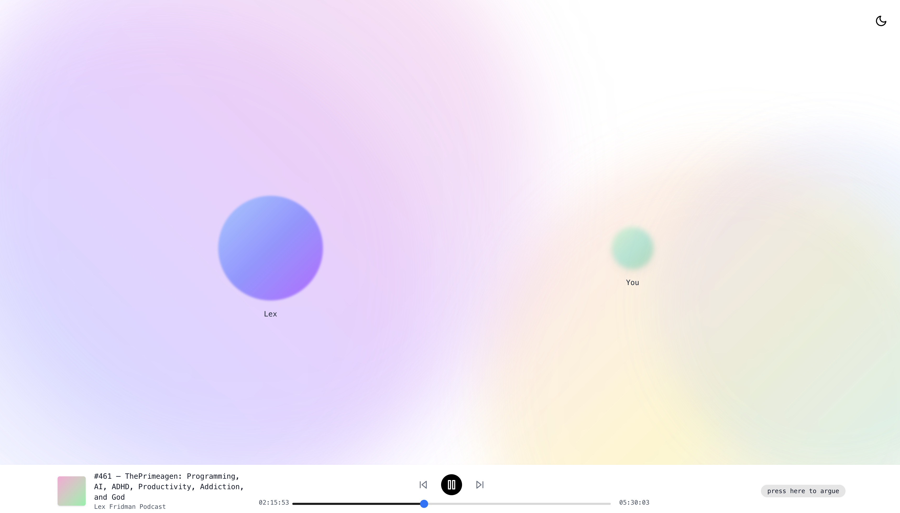

# Kritique
Debate your podcasters (currently supporting Lex Fridman). Podcasts are no longer one way monologues. Now you can engage with the creators.



# Flow
Kritique is a web app that supports playing Lex Fridman podcasts. Throughout, you can use the wake word "Hey Lex" to interrupt to ask a question. This will start a conversation with an [Eleven Labs](https://elevenlabs.io/) AI with the recent context from the podcast with which you can ask questions. When it sounds like you're done with the conversation, the AI will end the conversation and the podcast will continue playing from where you left off. 

# Getting Started
To run the app locally, in `site` run:

```shell
npm install
npm run dev
```

You'll also need to create `.env.local`
```
NEXT_PUBLIC_AGENT_ID=
NEXT_PUBLIC_PICOVOICE_ACCESS_KEY=
```

To use the app, you'll need to create an Eleven Labs conversation agent (recording the agent ID as `NEXT_PUBLIC_AGENT_ID`). You'll also use [Pico Voice](https://picovoice.ai/) to use the wake word. Create an account and add the access key (`NEXT_PUBLIC_PICOVOICE_ACCESS_KEY`). The Pico voice model (Porcupine) parameters for english audio and the `hey_lex` custom wake word file are already in `site/public`.  
